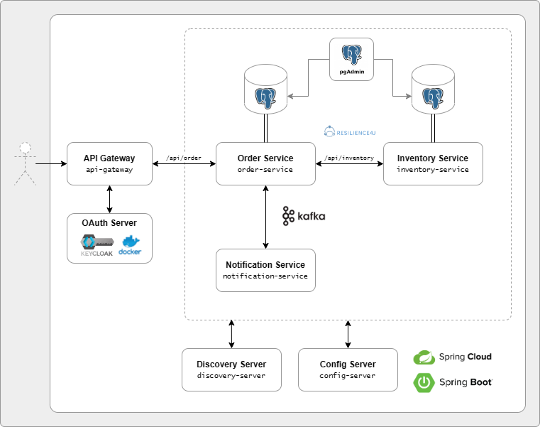

# The Microservices Project

This repo contains a simple microservice architecture, written in Java and using the Spring framework.

__As this project is currently being worked on. Further documentation will follow once all MVP features have been added.__

In the meantime, please feel free to explore the code or view my other projects, all of which will provide more details - for example:
1. [The Recipes Project @ Practice-Recipes-DB](https://github.com/kimgoetzke/Practice-Recipes-DB) (A simple multi-users web service, written in Java and using the Spring framework)
2. [Basic CI Project @ Practice-Basic-CI](https://github.com/kimgoetzke/Practice-Basic-CI) (A continuous integration pipeline using GitHub Actions, Gradle, Docker for Java applications)
3. [Muffin @ Concept-Muffin](https://github.com/kimgoetzke/Concept-Muffin) (The concept for a desktop game written in C#)

## Overview

## Instructions to run
1. Clone repo
2. Create separate repo for configurations
   1. Manually create second, local Git repo for configuration files
   2. Paste contents of the folder `resources/config-repo-files` into the newly created repo
   3. Add and commit all files to the newly created repo
   4. Open `application.properties` under `config-server/src/main/resources` 
   5. Update `spring.cloud.config.server.git.uri=file://${user.home}/IdeaProjects/Practice-Microservices-Config-Repo/` to reflect the correct path of the newly created repo
3. Set credentials... 
   1. ...for your local Postgres database by (a) replacing variables in `application.properties` in config repo with the actual credentials or (b) injecting them as environmental variables when starting services
   2. ...for __discovery server__  repeat (a) or (b) above (default credentials are `eureka` / `password`)
3. Set up KeyCloak on Docker
   1. Follow the steps provided by [KeyCloak - Getting Started on Docker](https://www.keycloak.org/getting-started/getting-started-docker) to set up KeyCloak as a Docker image
   2. Use default configuration with the following exceptions:
      1. Make sure to set the port to `8181` or update the `api-gateway.properties` file accordingly
      2. When creating a client, set `client authentication` to `On` and enable `Service accounts roles`
      3. When creating a client, disable `Standard flow` and `Direct access grants`
4. Run services in the following order: 
   1. `discovery-server`
   2. `config-server`
   3. `api-gateway`
   4. All other services

##### Notes
Without further modification, ports used by default are:
1. `8080` - `api-gateway`
2. `8888` - `config-server`
3. `8761` - `discovery-server`
4. `8181` - KeyCloak Docker image 

Ports for all other services will be assigned and controlled by the discovery server. 

As a result, all requests to business services must be made through `localhost:8080`.

At this point, the notification service only records logs for each event received.